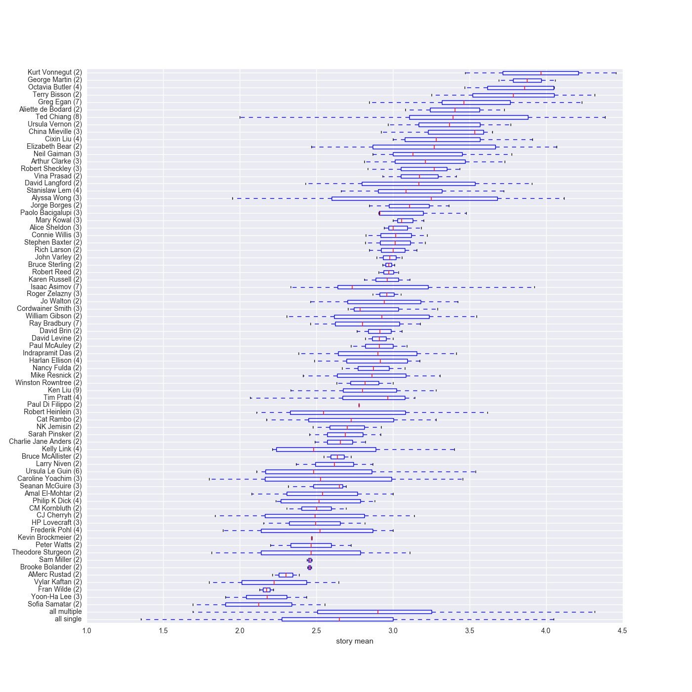

# shortsf_analysis

## [stories overview](https://raw.githubusercontent.com/gbhuang/shortsf_analysis/master/images/stories_plot.png)

- x-axis = story mean rating rank
- y-axis = story std rank
- color  = chooser
- size   = number of raters

## [author ratings](https://raw.githubusercontent.com/gbhuang/shortsf_analysis/master/images/author_means.png)

mean story ratings by author

## [sowing dissension](https://raw.githubusercontent.com/gbhuang/shortsf_analysis/master/images/chooser_stds.png)

story rating standard deviation by chooser

## [self-bias](https://raw.githubusercontent.com/gbhuang/shortsf_analysis/master/images/chooser_self_bias.png)

for each person, deviation from group mean, split into cases where
person is chooser versus not chooser

## [individual rater distributions](https://raw.githubusercontent.com/gbhuang/shortsf_analysis/master/images/rater_distribution.png)

violin plot showing distribution of scores per person

## [rater correlations](https://raw.githubusercontent.com/gbhuang/shortsf_analysis/master/images/rater_correlations.png)

regularized estimate of correlations between pairs of reviewers (10 observations minimum)

