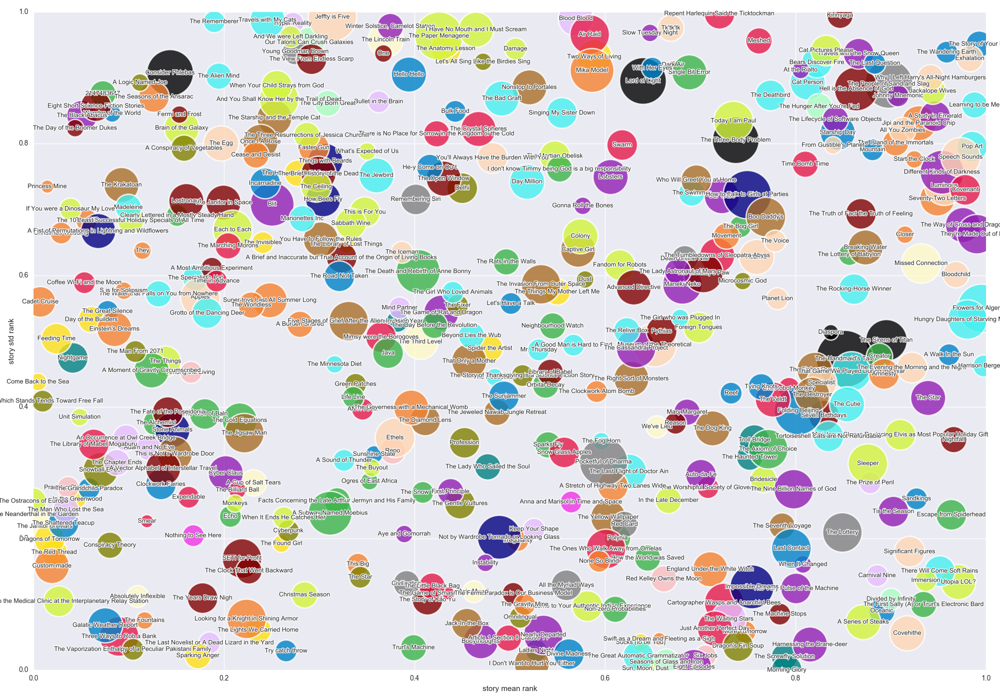
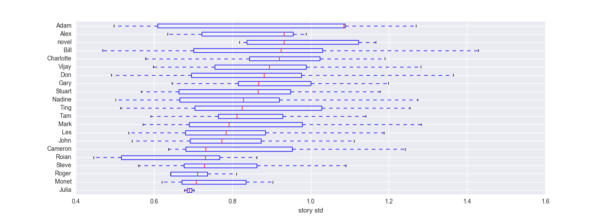

# shortsf_analysis

## stories overview

x-axis = story mean rating rank
y-axis = story std rank
color  = chooser
size   = number of raters

## author ratings

mean story ratings by author

## sowing dissension

story rating standard deviation by chooser

## self-bias

for each person, deviation from group mean, split into cases where
person is chooser versus not chooser

